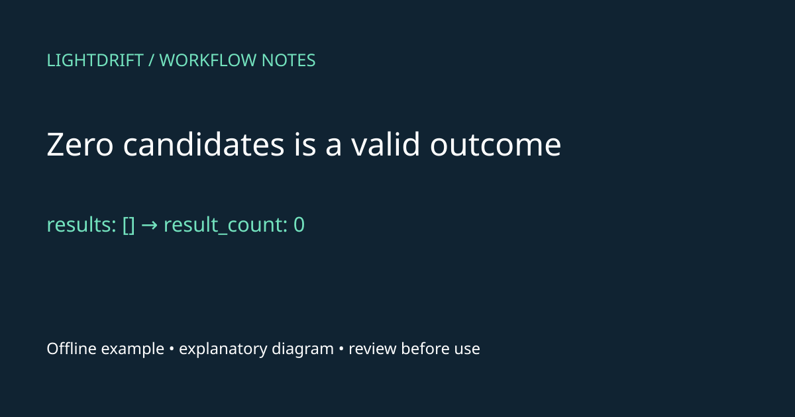
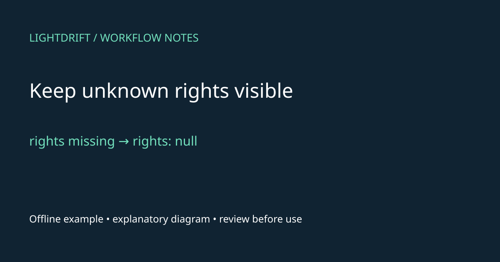

# Find candidate images for a content brief in n8n

Import a manual workflow that sends one text brief to Lightdrift and returns five candidate images at most for a newsletter, blog, or other content workflow. It uses n8n's built-in HTTP Request node and the existing Lightdrift API. It does not generate images, download media, select an image, or publish content.

## Import and connect your account

1. Download `workflow.json` from this directory (use GitHub's **Download raw file**).
2. In your n8n workflow editor, open the top-right **…** menu, select **Import from File**, and choose that JSON file. Save it. The workflow has only a Manual Trigger; keep it inactive. No schedule or webhook is included.
3. [Create a Lightdrift account](https://lightdrift.ai/sign-up?utm_source=github&utm_medium=example&utm_campaign=lig128_n8n_search_v1&utm_content=readme) and obtain your own API key through your account. Review [current pricing](https://api.lightdrift.ai/v1/pricing) and your available balance before live execution. On September 26, 2026, pricing returned **$0.005 per search ($5 per 1,000)**; one successful request at that rate costs $0.005, regardless of asking for five candidates. Account entitlements and billing rules still apply.
4. Open **Search Lightdrift**. Authentication is **Generic Credential Type**, Generic Auth Type is **Header Auth**. In its credential selector, replace the placeholder with your existing credential or choose **Create New**. Set header **Name** to `X-API-Key` and **Value** to your own Lightdrift API key. Save the credential and select it on the node. The JSON contains only a clearly labelled placeholder credential ID/name; there is no usable credential or secret in it. Keep your key in n8n credentials, not a query, Code node, HTTP body, or exported workflow.
5. Open **Your search settings** (Edit Fields). Enter your own `query`, for example `Coastal lighthouse at sunrise with open space for a newsletter headline`. Keep `allowLiveRequest` as Boolean **false** until ready for the bounded live check below. Use a nonempty brief of at most 1,000 characters. Composition is a request, not a guarantee.

The source query/filter shape follows the existing [presentation example](../presentation-image-search/README.md): `query`, `k: 5`, and `filters: { commercial: true, orientation: "landscape" }`. Other API defaults apply. The request also carries `experiment: "lig128_n8n_search_v1"` to identify this example; it contains no recipient or customer identifier.

## Offline check first — no account or searches

With Node.js installed, run from this directory:

```sh
node verify.mjs
```

This executes the workflow's validation and result-mapping code against **synthetic fixture data**, with no network calls. `fixture-response.json` uses `.invalid` URLs, unknown permissions, and a visibly fictional query ID. It is not a real search, recommendation, rights declaration, or downloadable image. The fixture is not pinned into the importable workflow.

See [VALIDATION.md](VALIDATION.md) for the precise tested versions and compatibility limits. n8n may report the missing credential before running any node until you bind your credential; offline verification does not require that binding.

### Observe a valid empty result without inventing an image

A valid search with zero matches still needs a visible outcome in a slide builder or editorial queue. The review node emits one item containing `result_count: 0` and `candidates: []`, so the application can display “No candidates for this brief” without manufacturing an image or losing the query ID.

Compare that with a malformed envelope: `results: {}` raises an error. The test below checks both paths. Do not turn every exception into an empty candidate list; that would hide response problems.



Diagram description: An empty results array becomes one review item with zero candidates; malformed results are rejected. The host application supplies empty-state copy. This is an explanatory diagram, not a search screenshot.

The accompanying `empty-results/` directory is included in this example. From the example directory, run:

```sh
node empty-results/demo.mjs
```

The bundle includes the review node from the [pinned working example](https://github.com/JacksonHolland/lightdrift-claude-plugin/tree/150921b4244e1ebe459e7ce79e54f1dd77a4b8db/examples/n8n-image-search). The command needs Node.js but no credentials, account, n8n server, or network. Its inputs are synthetic; IDs are fictional.

Observed output:

```text
[
  {
    "json": {
      "query_id": "offline-empty",
      "result_count": 0,
      "review_status": "Human source and license review required before use",
      "candidates": [],
      "response": {
        "query_id": "offline-empty",
        "results": []
      }
    }
  }
]
PASS: empty response preserves one review item; malformed results rejected.
```

Treat `result_count === 0` as the application's empty-state branch. Keep the brief and query ID available for the editor to revise the request deliberately. This is suggested host-app behavior, not an automatic retry or UI shipped by the workflow. A nonempty candidate list continues to source and license review; it does not mean an image is approved.

The test exercises the review Code node only. It does not execute the HTTP node, measure production empty-result rates, prove authentication, or import a workflow into an n8n server. Zero candidates alone says nothing about whether a request consumed credit. The malformed-envelope check is limited to the fixture shown; it is not a complete response-schema validator.

### Inspect absent and partial rights metadata before editorial use

An incomplete candidate must remain visibly incomplete in an editorial review screen. This defensive fixture deliberately omits `rights`; the mapping node retains the asset ID and represents missing `rights` and `source_page` as `null`. It also preserves the original response and the human-review reminder.

A second fixture supplies a partial rights object. The node preserves its `commercial: null` and `attribution_required: false` exactly, without filling in a license or source URL. That distinction lets a reviewer see what was declared and what remains unknown.



Diagram description: Missing rights and source-page metadata remain null. Partial rights are preserved unchanged, then shown to a human reviewer; the node does not enforce publication blocking. This is an explanatory diagram, not a search screenshot.

The accompanying `missing-rights/` directory is included in this example. From the example directory, run:

```sh
node missing-rights/demo.mjs
```

The bundle includes the review node from the [pinned working example](https://github.com/JacksonHolland/lightdrift-claude-plugin/tree/150921b4244e1ebe459e7ce79e54f1dd77a4b8db/examples/n8n-image-search). The command needs Node.js but no credentials, account, n8n server, or network. Its inputs are synthetic; IDs are fictional.

Observed output:

```text
[
  {
    "json": {
      "query_id": "offline-missing-rights",
      "result_count": 1,
      "review_status": "Human source and license review required before use",
      "candidates": [
        {
          "asset_id": "offline-placeholder",
          "title": null,
          "score": null,
          "source": null,
          "width": null,
          "height": null,
          "file": null,
          "thumb": null,
          "source_page": null,
          "rights": null
        }
      ],
      "response": {
        "query_id": "offline-missing-rights",
        "results": [
          {
            "asset_id": "offline-placeholder"
          }
        ]
      }
    }
  }
]
PARTIAL {"rights":{"commercial":null,"attribution_required":false},"source_page":null}
PASS: absent rights/source page stay null; partial rights and false flags survive unchanged.
```

In the host application, label missing rights or source evidence as “Needs source review” and keep the item out of automatic selection until your review process resolves it. This is an integration recommendation: the existing node returns data and a reminder; it does not enforce a downstream publishing gate.

A `null` permission is unknown. A preserved `false` flag is not a general permission grant, and a present rights object is not necessarily complete. Consult the [rights guidance](https://docs.lightdrift.ai/guides/rights) and original source declaration for the intended use. This test concerns missing metadata handling; it does not establish that actual API responses omit rights, clear copyright or other rights, or implement attribution export. No source page or media was downloaded by this offline test.

## Optional live check: one manual request

Only after reviewing your account, pricing, query, and selected credential:

1. In **Your search settings**, set Boolean `allowLiveRequest` to **true**.
2. Click **Execute workflow** exactly once. Run the entire workflow from its Manual Trigger, not the HTTP node directly. The validation node requires exactly one input item. The HTTP node has Execute Once enabled, no pagination, no retry, a 60-second timeout, and redirects off.
3. Open **Review image candidates** and inspect its JSON output. Preserve `query_id` as your receipt and confirm the execution/usage in your own account.
4. Immediately set `allowLiveRequest` back to **false** and save. The flag is an explicit per-execution opt-in convention, **not a self-resetting or account-wide spend cap**. Leaving it true and executing again sends another request. Editing nodes, running a node directly with previous input, or adding triggers changes these bounds.

No live request was made to validate this example. Do not infer working authentication or live search quality from the offline tests. On a non-2xx response, the HTTP node stops the workflow. For 401/403 inspect credentials/access; for balance or rate-limit errors inspect your account and the [API docs](https://docs.lightdrift.ai/api-reference/introduction). No automatic retry is configured. A timeout or interrupted connection can still have consumed search credit: inspect usage before choosing whether to rerun. Avoid sharing execution exports containing keys, headers, or private briefs.

## Review source and license before using a candidate

The final node emits one item even for zero results. It includes `query_id`, `result_count`, a review reminder, and a `candidates` array with `asset_id`, `title`, `score`, `source`, dimensions, `file`, `thumb`, `source_page`, and full `rights`. It also preserves the entire original response in `response`, including `degraded`, backend, ranking, and any future fields. Null scores/titles and missing rights remain unknown. Scores are not calibrated probabilities. Empty results are a valid outcome.

Open the candidate's `source_page` (`rights.provenance_url`) and review the source declaration, `license`, `license_verbatim`, `commercial`, `derivatives`, `share_alike`, `attribution_required`, `attribution`, and `basis`. Unknown/null permission flags are not permission. Carry required attribution into the eventual content. Source-declared commercial permission is not clearance for every use; consider people, logos, and artwork separately. Review subject accuracy and composition with the content author. See [Lightdrift rights guidance](https://docs.lightdrift.ai/guides/rights).

The workflow stops at human review. If you later fetch `file` or `thumb`, the documented asset URL redirects to a signed link valid for one hour. Use a separate download step without the Lightdrift credential; this search node deliberately refuses redirects. Do not send your API key to an image host or source site.

## Limits and rollback

This is a small example, not a bulk content pipeline: no schedules, retries, loops, automatic selection, media downloads, or CMS writes. It requires JavaScript Code nodes enabled and built-in nodes matching the versions in [VALIDATION.md](VALIDATION.md). End-to-end n8n UI import, credential binding, and a real search remain user-side checks; package-level and fixture checks passed. Responses are documented examples rather than a typed OpenAPI success schema, so the final node validates the envelope and preserves fields rather than assuming every result is complete.

To stop, leave `allowLiveRequest` false or remove this workflow. Delete its dedicated n8n credential if no other workflow needs it. Revoke an API key in your Lightdrift account if appropriate. To roll back a repository publication, remove `examples/n8n-image-search/` and its index link. No product deployment, database migration, or billing change is involved.

## Sources

Checked September 26, 2026: [Lightdrift OpenAPI](https://api.lightdrift.ai/openapi.json), [response/auth docs](https://docs.lightdrift.ai/api-reference/introduction), [rights](https://docs.lightdrift.ai/guides/rights), [pricing](https://api.lightdrift.ai/v1/pricing), and the existing presentation example at repository commit `48fd5593a7bcd42beee8cd57fe4ebe982f6b985c`.

Official n8n instructions: [import/export](https://docs.n8n.io/workflows/export-import/), [HTTP Request](https://docs.n8n.io/integrations/builtin/core-nodes/n8n-nodes-base.httprequest/), [Header Auth](https://docs.n8n.io/integrations/builtin/credentials/httprequest/), and [Code](https://docs.n8n.io/integrations/builtin/core-nodes/n8n-nodes-base.code/). Example version 1.0.0. Publication and subsequent adoption are separate from these compatibility results.
